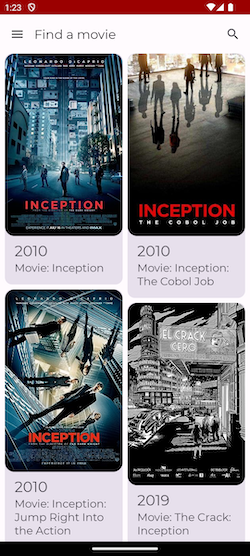
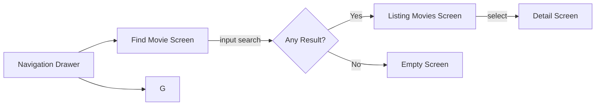

# Jetpack MVI Sample App

This sample app highlights a robust Android architecture, emphasizing scalability, maintainability, and testability through the MVI (Model-View-Intent) pattern, making it a valuable reference for developers.

The sample app presents a modern Android application architecture, emphasizing scalability and maintainability through the implementation of MVI (Model-View-Intent).

# Table of Contents

1. [Description](#description)
   1. [Screenshots](#screenshots)
   2. [Flowchart](#flowchart)
   3. [Skills you may find](#skills-you-may-find)
   4. [Design Patterns implemented](#design-patterns-implemented)
   5. [Domain model](#domain-model)
   6. [Architecture](#architecture)
2. [Resources](#resources)

# Description

This is a sample project with the main objective of integrating [Jetpack components](https://developer.android.com/jetpack) 
as much as possible in a single app.  
Additionally, the project try to implement ideas from Domain-Drive Design, Design Patterns, and 
Clean Architecture mainly focused on the Dependency Inversion principle.  

The app topic is Movies and you may find functionalities such as: 
* search movies by name. 
* see the movie extra details. 

## Screenshots

## Flowchart

## Skills you may find

| Jetpack       | Kotlin & Quality    | Dependency Management | Others        | Testing           |
|---------------|---------------------|-----------------------|---------------|-------------------|
| `Compose`     | `Coroutines`        | `Version Catalogs`    | `Landscapist` | `MockK`           |
| `WorkManager` | `Asynchronous Flow` | `TOML`                | `Material 3`  | `ComposeTestRule` |
| `Hilt`        | `Detekt`            | `Gradle Kotlin DSL`   | `Retrofit`    |                   |
| `Room`        | `Ktlint`            |                       | `OkHttp`      |                   |
| `Paging`      |                     |                       | `Timber`      |                   |
| `Navigation`  |                     |                       | `Lottie`      |                   |

## Design Patterns implemented

| Creational | Structural | Behavioral              |
|------------|------------|-------------------------|
| Singleton  | Facade     | Command                 |
|            |            | Chain of Responsibility |
|            |            | State                   |

## Domain Model
The Domain Model pattern is shown here in a very simple way.   
This project is trying to follow the ideas explained in [Domain-Driven Design book of Eric Evans](https://a.co/d/hnmkp9y).  

## Architecture
It's strongly recommended to read [Clean Architecture book of Robert C. Martin](https://a.co/d/2zkv7YX) 
for a better understanding and avoiding misconceptions out there.   
As a glimpse, read Clean Code blog: https://blog.cleancoder.com/uncle-bob/2012/08/13/the-clean-architecture.html

# Resources

* 📝 **Kotlin Docs:** https://kotlinlang.org/docs/home.html
* 🚀 **Kotlin Release:** https://github.com/JetBrains/kotlin/releases
* 📣 **Kotlin Blog:** https://blog.jetbrains.com/kotlin/
* 🎥 **Kotlin Youtube Channel:** https://www.youtube.com/channel/UCP7uiEZIqci43m22KDl0sNw
* 🤖 **Kotlin Reddit:** https://www.reddit.com/r/Kotlin/
* 🤯 **Kotlin StackOverflow:** https://stackoverflow.com/questions/tagged/kotlin
* 🗺️ **Kotlin Community:** https://kotlinlang.org/community/

* 📝 **Platform Architecture:** https://developer.android.com/guide/platform
* 👩‍💻👨‍💻 **Android Developers:** https://developer.android.com/
* **Android Jetpack:** https://developer.android.com/jetpack
* **Sunflower:** https://github.com/android/sunflower
* **Compose Samples:** https://github.com/android/compose-samples

